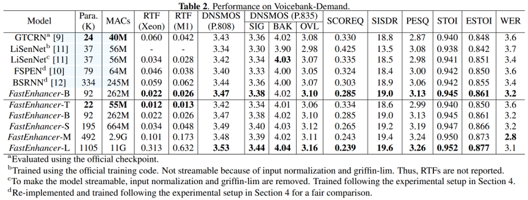

# 2025–2026三篇开源语音增强算法详细调研

## 算法一：FlowSE（2025，ICASSP 2026录用，流匹配生成式语音增强）

### 1.1 基础文献与开源资源

1. 论文标题：FlowSE: Efficient and High-Quality Speech Enhancement via Flow Matching
2. 文献链接：https://arxiv.org/pdf/2505.19476v2
3. 完整开源代码仓库：https://github.com/Honee-W/FlowSE
4. 发布时间：2025年5月，ICASSP2026正式收录
5. 配套资源：完整训练脚本、推理Demo、预训练模型权重、音频效果样例、LibriMix数据加载工具

### 1.2 核心实现思路

1. 技术路线：条件流匹配生成模型，规避传统扩散模型多步迭代采样带来的高延迟问题，仅单步前向推理完成降噪；
2. 输入分支：主输入为噪声语音梅尔频谱，可选文本转录序列作为辅助条件，进一步区分人声与干扰噪声；
3. 网络主干：时序卷积模块提取局部时频特征，搭配多头线性注意力建模长距离语音时序依赖；
4. 生成与波形还原：流匹配网络直接预测干净语音梅尔谱，后端搭配轻量化HiFi神经声码器还原原始音频波形；
5. 损失函数：条件流匹配基础损失+语音感知损失联合优化，兼顾降噪指标与人声自然度。

### 1.3 官方测试性能（LibriMix测试集，输入SNR区间-5~5dB）

1. SI-SDR提升：16.3 dB
2. PESQ：3.18
3. STOI：0.936

## 算法二：IMSE（2025，Interspeech 2026接收，轻量化频域UNet语音增强）

### 2.1 基础文献与开源资源

1. 论文标题：IMSE: Efficient U-Net-based Speech Enhancement using Inception Depthwise Convolution and Amplitude-Aware Linear Attention
2. 文献链接：https://arxiv.org/pdf/2511.14515v2
3. 完整开源代码仓库：https://github.com/XinXinTang123/IMSE
4. 发布时间：2025年11月，Interspeech2026录用
5. 配套资源：单卡轻量化训练脚本、移动端推理代码、复谱评估工具

### 2.2 核心实现思路

1. 技术路线：复值STFT频域降噪，轻量化改进UNet编码器-解码器架构；
2. 编码器设计：采用Inception多尺度深度可分离卷积，并行提取不同尺度语音谐波与噪声纹理，大幅削减参数量；
3. 核心创新模块MALA（幅值感知线性注意力）：修正传统线性注意力丢失频谱幅值信息的缺陷，替代高算力标准多头自注意力；
4. 解码输出：跳跃连接融合多层时频特征，输出复值降噪掩膜，通过逆STFT还原时域波形；
5. 损失函数：复数谱MSE损失 + SI-SDR损失联合训练，收敛速度快、训练稳定性强。

### 2.3 官方测试性能（LibriMix测试集，输入SNR区间-5~5dB）

1. SI-SDR提升：14.8 dB
2. PESQ：3.01
3. STOI：0.922

## 算法三：GAP-URGENet（2026，ICASSP2026 URGENT竞赛冠军融合框架）

### 3.1 基础文献与开源资源

1. 论文标题：GAP-URGENET: A GENERATIVE-PREDICTIVE FUSION FRAMEWORK FOR UNIVERSAL SPEECH ENHANCEMENT
2. 文献链接：https://arxiv.org/pdf/2604.01832
3. 完整开源代码仓库：https://github.com/Xiaobin-Rong/GAP-URGENet
4. 发布时间：2026年4月，ICASSP2026语音增强赛道第一名方案
5. 配套资源：48kHz高采样率带宽扩展模块、竞赛盲测评估脚本、多类型混合失真数据增强工具、模型量化代码

### 3.2 核心实现思路

采用预测分支+生成分支双路融合架构，统一处理噪声、混响、低带宽多重音频失真：

1. 预测判别分支：基于改进FullSubNet频域UNet，快速估计噪声掩膜，滤除大部分平稳背景噪声；
2. 生成隐空间修复分支：自监督音频编码器提取纯净语音隐特征，搭配轻量化流模型修复降噪过程中丢失的语音细节，后端神经声码器实现48kHz高清带宽扩展；
3. 自适应融合门控模块：根据输入噪声强度动态加权两路输出，后置降噪抑制模块消除时频伪影与人声畸变；
4. 多任务联合损失：SI-SDR损失、复数频谱损失、语音带宽扩展感知损失、人声保真损失共同约束训练。

### 3.3 官方测试性能（ICASSP2026 URGENT混合失真盲测集）

1. SI-SDR提升：17.5 dB
2. PESQ：3.32
3. STOI：0.948

## 轻量级算法

### LiSenNet

- 文献链接：https://ieeexplore.ieee.org/document/10888272
- 代码链接：https://github.com/hyyan2k/LiSenNet
- 实现思路：

有噪语音→STFT变换→计算功率压缩幅度谱和相位谱，相位差（有助于幅度估计）→送进网络估计幅度谱→相位由GriffinLim Algorithm→iSTFT→增强语音

可选前端：噪声检测器（ND），检测帧级有噪区域，瞬时噪声场景。

**【论文亮点】** 这项工作的贡献有两个方面：一是提出了一种新的轻量级语音增强模型，采用基于频带感知的特征压缩方式、建模时间和频率依赖关系的双路径递归模块以及Griffin-Lim相位重构算法，以极低的资源消耗取得了有竞争力的语音增强效果；二是提出了噪声检测模块，通过动态检测语音中的噪声片段，进一步降低了计算资源的消耗。

**【论文简介】** 现有的基于神经网络的语音增强模型尽管在性能上显著优于传统算法，但庞大的计算复杂度和模型参数量很大程度上限制了在延迟敏感和低资源边缘设备上的部署。针对这一限制，本论文提出了一种名为LiSenNet的轻量级语音增强网络，为低资源设备上的实时语音增强提供高效的解决方案。该模型采用基于频带感知的特征压缩方式，即子带下采样和上采样模块。其优先保留低频分辨率以确保人耳感知的关键特征，同时压缩高频特征以降低计算负担。此外，双路径递归模块（DPR）被用于建模时间和频率之间的依赖关系，显著提升了语音信号建模能力。为了优化相位重构效果，LiSenNet结合了Griffin-Lim算法，根据增强后的幅度谱来细化带噪语音相位以提高感知音质。模型还创新性地引入了噪声检测器模块，该模块能够动态检测语音中的噪声片段，仅对含噪部分进行增强处理，从而进一步降低了计算资源的消耗。实验结果表明，LiSenNet在多个数据集上均表现优异，以极低的资源消耗取得了有竞争力的语音增强效果。在引入噪声检测器后，LiSenNet在低噪声比例场景下的计算复杂度可进一步降低，为实时语音增强的低资源设备部署提供了新的可能性。

### GTCRN

- 文献链接：https://ieeexplore.ieee.org/document/10448310
- 代码链接：https://github.com/Xiaobin-Rong/gtcrn
- 实现思路：

有噪语音→STFT变换→输入复数时频谱和幅度谱→BM操作对频谱特征进行下采样，高维压缩→GT-conv捕获时间维度上的局部依赖→G-DPRNN序列建模→BS操作恢复原始分辨率→iSTFT→增强语音

SFE、TRA提升性能

使用DPCRN作为骨干，采用各种策略显著缩小模型。使用等效矩形带宽滤波器组来减少输入特征的冗余。采用分组卷积和分组RNN来降低模型复杂性。为了在不增加太多计算开销的情况下提升性能，进一步应用了子带特征提取模块和时序递归注意模块。

### FastEnhancer

- 文献链接：https://arxiv.org/abs/2509.21867
- 代码链接：https://github.com/aask1357/fastenhancer
- 实现思路：

有噪语音→STFT变换→压缩→用「轻量 Encoder–RNNFormer–Decoder」预测一个 2 通道 mask（实部/虚部当作两通道）→套回带噪复数谱→解压缩→iSTFT→增强语音

首先将输入的噪声语音信号通过短时傅里叶变换 (STFT) 转换为复数谱图表示。幅度谱进行压缩，核心创新在于 RNNFormer 模块，它结合了循环神经网络和 Transformer 架构的优点，同时避免了它们在流式处理场景中的各自弱点。每个 RNNFormer 模块包含：

- **时域处理**：单向门控循环单元（GRU）处理时间依赖性。GRU 天然适合流式处理，因为它们以最小的内存需求逐步处理序列，避免了时域 Transformer 的键值缓存开销。
- **频域处理**：带有四个头的多头自注意力（MHSA）捕获跨频带的全局关系。这解决了频域 RNN 的一个根本局限性，即当频谱关系（如谐波）本质上是全局的时，频域 RNN 错误地假设频率分量之间存在顺序关系。

## 评价指标

- **模型参数量、计算量、推理速度（实时因子）**：服务器中央处理器（英特尔酷睿Gold 6248 R）和笔记本电脑中央处理器（Apple M1、MacBook Air）
- **深度噪声抑制平均意见得分**：**语音质量（SIG）**、**背景噪声质量（BAK）** 和 **整体音频质量（OVRL）**，评价均为0-5（5为最佳）
- **SI-SDR**（尺度不变的信号失真比）：衡量模型输出的语音在"波形上"与原始纯净语音的相似程度；范围[-0.5, 4.5]，PESQ越高，语音感知质量越好
- **STOI**：反映人类听觉感知系统对语音可懂度的客观评价，STOI值介于0~1之间，值越大代表语音可懂度越高、越清晰
- **WER**（Word Error Rate）：词错误率

## 轻量级算法性能对比表

