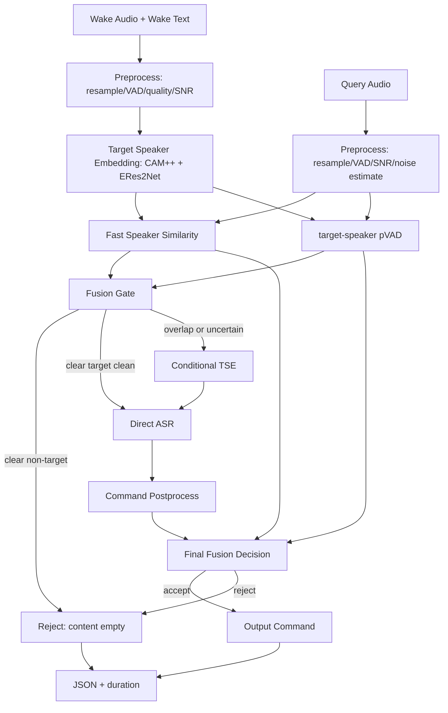

# 复杂交互场景的抗干扰语音指令识别技术解决方案

## 1. 比赛任务总结

本题要求构建一套面向智能家居远场交互的抗干扰语音指令识别系统。系统输入包括：

- 唤醒音频：用于注册目标发音人的身份信息；
- 唤醒文本：用于辅助校验唤醒音频质量；
- 待识别音频：可能来自目标发音人、非目标发音人、多人重叠场景或强噪声场景；
- 待识别文本标签：开发 / 测试 A 阶段用于本地评估，拒识样本标签为空。

系统输出为：

- 目标发音人的家居控制指令文本；或
- 非目标发音人 / 无有效目标语音场景下的空字符串。

这本质上是一个 **enrollment-conditioned target-speaker ASR** 问题，不是普通 ASR。系统必须同时完成目标说话人确认、非目标拒识、重叠语音目标提取、低信噪比鲁棒识别和高效部署。

## 2. 比赛规则与评分机制

| 评分项 | 权重 | 技术含义 | 核心风险 |
|---|---:|---|---|
| 目标发音人 CER | 40% | 目标人语音识别准确性 | 噪声、重叠、分离伪影导致识别错误 |
| 非目标发音人拒识率 RR | 40% | 非目标人语音是否被正确拒识 | 把旁人、电视、人声噪声识别成有效指令 |
| 推理效率 | 20% | batch=1 推理耗时和内存占用 | 堆叠过多大模型导致效率分下降 |

测试集包含：

- 正样本测试集；
- 拒识测试集；
- SNR 约从 -5 dB 到 5 dB；
- 说话人重叠率从 0% 到 100%；
- 同一时间最多 2 个说话人；
- 除人声外还有空调噪声等非人声干扰。

## 3. 必须满足的硬性需求

| 需求 | 说明 | 推荐实现 |
|---|---|---|
| 利用唤醒音频发音人信息 | 必须识别唤醒人，不是所有人 | speaker embedding + speaker verification |
| 拒识非目标人 | 拒识标签为空，输出应为空字符串 | accept / reject 决策层统一控制 |
| 目标与干扰人重叠时只识别目标人 | 普通 ASR 会输出混合内容 | target-speaker pVAD + 条件式 TSE |
| 低 SNR 鲁棒性 | -5 dB 场景必须可用 | 噪声增强、远场增强、ASR 微调 |
| 推理效率 | 20% 分数，不能无节制堆模型 | 轻量门控 + 条件触发复杂模型 |
| JSON 格式 | 官方按单个 JSON 文件评估 | schema 校验、独立 result writer |
| 代码可核查 | 测试 B 赛后核查代码和耗时 | 固定依赖、模型、随机种子、推理入口 |

## 4. 隐性高分需求

1. **阈值校准优先级极高**：CER 和 RR 权重相同，阈值过松会误接收，阈值过紧会误拒识。
2. **整段 speaker similarity 不够**：重叠语音会污染 query embedding，需要帧级 target-speaker pVAD。
3. **TSE 不能全量跑**：全量目标提取会拖慢推理，只应在疑难样本触发。
4. **命令纠错必须在接收之后**：否则可能把非目标语音纠成合法命令，损害 RR。
5. **验证集必须 speaker-disjoint**：否则说话人验证指标虚高。
6. **要按场景分桶评估**：平均指标可能掩盖 -5 dB、100% overlap、相似音色负样本上的灾难。

## 5. 三套方案

### 5.1 方案 A：稳健保守 baseline

```text
Wake Audio -> VAD -> Speaker Embedding
Query Audio -> VAD -> Speaker Embedding -> Similarity Gate
                                      -> Reject or ASR
                                      -> Command Postprocess
```

推荐模型：

- VAD：Silero VAD / FunASR FSMN-VAD；
- Speaker Verification：CAM++ / ERes2Net / ECAPA；
- ASR：Paraformer-zh / SenseVoice-small；
- 后处理：家居命令热词、文本规范化、拼音纠错。

优点：实现快，效率高，适合一周内形成可提交版本。  
缺点：重叠场景和相似音色负样本较弱。

### 5.2 方案 B：高分竞赛主方案

```text
Wake Audio -> VAD + Quality -> Multi-crop Speaker Embedding
Query Audio -> VAD + SNR -> Speaker Similarity
                         -> target-speaker pVAD
                         -> overlap / uncertainty gate
                         -> Direct ASR or Conditional TSE + ASR
                         -> Command Postprocess
                         -> Fusion Decision
```

新增模块：

- target-speaker pVAD：帧级判断 silence / target / non-target；
- 条件式 TSE：只在重叠或不确定样本使用 VoiceFilter / SpeakerBeam 风格模型；
- 融合决策：联合 SV、pVAD、ASR confidence、SNR、wake quality 做 accept / reject。

优点：兼顾 CER、RR 和效率，是主推方案。  
缺点：需要合成训练数据训练 pVAD / TSE，阈值校准复杂。

### 5.3 方案 C：冲击特等奖增强方案

```text
Wake Encoder + Query Encoder
       -> Speaker-conditioned Mask / Target Encoder
       -> Target-speaker ASR Decoder
       -> Auxiliary target/non-target VAD Head
       -> Joint Confidence Decision
```

这是端到端或半端到端 Target Speaker ASR 路线，可作为方案 B 的疑难样本增强模块，也可作为决赛创新点。  
优点：理论上限高，创新性强。  
缺点：训练成本高，研发风险大，不应作为唯一主线。

## 6. 最终推荐方案

推荐以方案 B 为主，方案 C 为增强：



## 7. 模块设计

### 7.1 音频预处理

输入：raw wav。  
输出：16 kHz mono wav、VAD segments、SNR estimate、speech ratio。

处理步骤：

1. 统一采样率为 16 kHz；
2. 转单声道；
3. 响度归一化；
4. VAD 去除无效静音；
5. 估计 SNR 和噪声强度；
6. 对稳定噪声可使用轻量降噪，但避免过度降噪产生 ASR 伪影。

### 7.2 唤醒音频建模

目标：从唤醒音频中提取目标发音人的稳定 embedding。

推荐策略：

- VAD 后只保留有效语音；
- 如果 wake 较长，做多裁剪 embedding 平均；
- 如果 wake 较短，整段提取，并降低该 embedding 在融合决策中的权重；
- 计算 wake quality，包括有效语音时长、SNR、embedding 方差。

### 7.3 目标说话人判别

使用三层门控：

```text
similarity >= accept_high: 高置信目标，进入 ASR
similarity <= reject_low: 高置信非目标，直接拒识
otherwise: 进入 pVAD / TSE / 融合决策
```

推荐不要只使用固定阈值，应根据 wake quality、query SNR、target ratio 动态调整。

### 7.4 target-speaker pVAD

输入：query audio + target speaker embedding。  
输出：逐帧标签概率：silence / target / non-target。

核心特征：

- `target_frame_ratio`：目标帧占比；
- `non_target_frame_ratio`：非目标帧占比；
- `overlap_probability`：重叠概率；
- `target_speech_duration`：目标语音时长。

该模块用于解决：

- query 整段 embedding 被干扰人污染；
- 目标和非目标同时说话；
- 非目标人说合法命令时的误接收。

### 7.5 条件式 TSE

仅在以下情况触发：

- pVAD 显示目标和非目标重叠；
- speaker similarity 处于中间区间；
- ASR 置信度低但目标帧比例较高；
- SNR 很低且疑似有目标语音。

不建议全量运行 TSE，原因是：

- 会增加推理时延；
- 分离伪影可能使干净样本的 ASR 变差；
- 内存占用增加。

### 7.6 ASR 模块

候选模型：

| 模型 | 优点 | 风险 | 推荐用途 |
|---|---|---|---|
| Paraformer-zh | 中文强、非自回归、速度快 | 参数量仍需优化 | 主模型 |
| SenseVoice-small | 多任务、鲁棒性好、推理较快 | 需核查权重许可和部署体积 | 备选 / teacher |
| Whisper | 多语言鲁棒、泛化好 | 大模型慢，自回归 | teacher / 离线伪标签 |
| Zipformer | 快速、省显存 | 接入成本较高 | 高效部署增强 |
| WeNet Conformer | 训练成熟 | 改造 target-speaker 成本高 | 研究增强 |

主推：**Paraformer-zh 或 SenseVoice-small 二选一作为常驻 ASR**。另一个模型可离线生成伪标签，不建议两个大模型同时常驻内存。

### 7.7 指令后处理

仅在 final accept 之前、但身份证据已经足够时启用。包括：

- 中文文本规范化；
- 标点和空格清理；
- 数字统一；
- 家居命令词表纠错；
- 拼音相似纠错；
- 热词命中 rerank。

注意：后处理不能把 reject 样本强行改成合法命令。

### 7.8 融合决策

建议融合分数：

```text
final_score =
  w1 * speaker_similarity
+ w2 * target_frame_ratio
- w3 * non_target_frame_ratio
+ w4 * asr_confidence
+ w5 * command_prior_score
- w6 * enrollment_bad_quality
- w7 * query_noise_penalty
```

最终规则：

```text
if no_speech:
    reject
elif target_frame_ratio < min_target_ratio and speaker_similarity < accept_high:
    reject
elif final_score >= fusion_accept_threshold:
    accept
else:
    reject
```

## 8. 训练策略

### 8.1 数据 episode 构造

每个训练样本构成：

```text
wake_audio: speaker A 的唤醒音频
query_audio:
    case 1: speaker A 指令，正样本
    case 2: speaker B 指令，拒识样本
    case 3: speaker A + speaker B 重叠，识别 A
    case 4: speaker B + noise，无 A，拒识
label:
    正样本为 speaker A 的指令文本
    拒识样本为空字符串
```

### 8.2 数据增强

| 增强 | 范围 |
|---|---|
| SNR | -8、-5、0、5、8 dB |
| 重叠率 | 0%、25%、50%、75%、100% |
| 噪声 | 空调、风扇、厨房、电视、白噪声、MUSAN |
| 远场 | RIR 卷积、房间混响、麦克风频响退化 |
| wake 退化 | 短 wake、带噪 wake、低音量 wake |
| 语速 | 0.9、1.0、1.1 |
| 负样本 | 相似音色、同文本、同性别、电视背景人声 |

### 8.3 训练顺序

1. 建立 ASR + SV baseline；
2. 构造增强数据；
3. 校准 speaker verification 阈值；
4. 训练 pVAD；
5. 训练或接入 TSE；
6. 微调 ASR；
7. 训练融合决策器；
8. 做消融实验和分桶评估。

## 9. 推理与提交

每条样本推理流程：

1. 读取 wake audio、wake text、query audio；
2. 预处理并提取 wake embedding；
3. query VAD，若无有效语音直接拒识；
4. 计算 speaker similarity；
5. 运行 pVAD；
6. 三段式门控；
7. 必要时运行 TSE；
8. ASR；
9. 命令后处理；
10. 融合决策；
11. 写入 JSON；
12. 记录 batch=1 推理耗时和内存。

## 10. 极端情况处理

| 情况 | 处理 |
|---|---|
| 唤醒音频很短 | 降低 speaker embedding 权重，增加 pVAD 和 ASR 置信度权重 |
| 唤醒音频有噪声 | VAD + 轻量降噪 + wake quality 动态阈值 |
| query 只有非目标 | similarity 低且 target ratio 低，直接拒识 |
| 目标和非目标同时说话 | 触发 TSE，只识别目标人 |
| 非目标音色像目标 | hard negative 训练 + 双 speaker 模型融合 + pVAD |
| 空调噪声很强 | 稳态噪声增强，避免过度降噪 |
| SNR = -5 dB | 使用增强 / TSE 路径，结合目标帧证据 |
| ASR 有内容但 speaker 低置信 | 拒识，优先保护 RR |
| speaker 通过但 ASR 低置信 | 检查 pVAD 和命令先验，必要时拒识 |
| 无有效语音 | `content=""` |

## 11. 消融实验

| 实验 | 目的 |
|---|---|
| ASR only | 验证普通 ASR 的上限和拒识问题 |
| SV + ASR | 验证身份门控贡献 |
| SV + pVAD + ASR | 验证帧级目标检测贡献 |
| SV + pVAD + TSE + ASR | 验证重叠场景提升 |
| + Command Postprocess | 验证短指令纠错贡献 |
| + Fusion Decision | 验证多证据融合贡献 |
| + ONNX / INT8 | 验证部署效率贡献 |

## 12. 最终结论

最终方案应以“高分竞赛主方案”为主线：**轻量门控保证效率，target-speaker pVAD 和条件式 TSE 解决重叠与拒识，快速中文 ASR 和命令后处理降低 CER，融合决策平衡 CER 与 RR。**

该路线最符合比赛 40% CER、40% RR、20% 效率的评分结构，同时具备决赛答辩所需的新颖性、可解释性、落地性和可扩展性。
