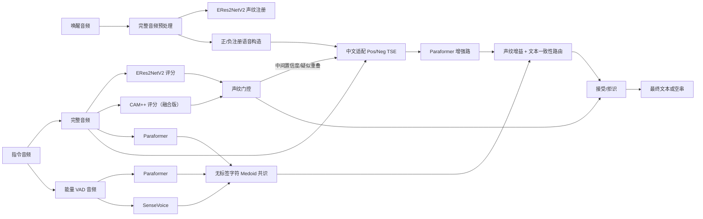

# 抗干扰目标说话人语音识别优化方案与复现结果（2026-07）

## 1. 任务理解

比赛输入是一对“唤醒音频 + 指令音频”。系统需要利用唤醒音频中的发音人信息：

1. 在正样本中输出目标发音人的指令文本，降低 CER；
2. 在拒识样本中不输出非目标发音人的内容，提高 RR；
3. 在最多两人重叠、-5 dB 至 5 dB 信噪比、远场噪声和混响下保持可用速度。

官方权重为 CER 40%、RR 40%、推理效率 20%。因此，“一律放宽声纹阈值”可以降低 CER，却会严重损失 RR；“一律先分离再识别”又会在分离选错人时显著抬高 CER。最终系统必须同时保留原音频路径、目标说话人路径和可靠性门控。

### 对队长方案的吸收与修正

- **正确方向**：唤醒词音频应作为目标说话人注册音频；重叠语音不能只靠普通降噪；短音频目标说话人提取是主要突破口。
- **需要修正**：固定唤醒词文本只能帮助定位唤醒词区间，不能生成该用户的声纹。相同文本由不同人朗读，文本模板不包含身份信息。
- **需要修正**：盲源分离会产生通道排列不确定性。即使成功分出两路，也必须用唤醒声纹判断哪一路是目标。
- **需要修正**：论文 TSE 权重不能直接全量替换原音频。真实 DatasetA 抽样中全量 TSE 的 CER 明显变差，因此只把它作为困难样本候选。
- **指标解释**：15 dB SI-SNRi 可以作为理想研究目标，但不能直接等价为 90% 指令准确率，也不应在没有干净目标源的比赛数据上伪造该指标。

## 2. 最终算法架构



### 关键实现

- **短语音声纹**：ERes2NetV2，1.5 秒分段，3 段取 top-2 均值；融合版加入 CAM++，权重 0.54/0.46。
- **三路 ASR**：同一 Paraformer 分别识别能量裁剪和完整音频，再加入 SenseVoice。选择器不读取标签，而是寻找三路文本的字符编辑距离中心，并使用轻量家居命令语法打破平局。
- **TSE**：复现 NeurIPS 2025 正/负注册语音 TSE improved monaural 模型；冻结注册编码器，仅微调约 98.6 万个分离主干参数。
- **TSE 保护路由**：增强文本必须接近至少一路原始 ASR、命令先验不差、增强后声纹相似度不能明显坍塌，才允许替换原始共识文本。

## 3. 数据与训练边界

### 用于模型训练

- CN-Celeb2：中文说话人域适配；训练、验证、最终外部验证按说话人完全隔离。
- MUSAN noise：环境噪声增强。
- RIRS_NOISES simulated RIR：房间混响增强。

### 仅用于开发评测

- DatasetA：没有参与 TSE、ERes2NetV2、CAM++、Paraformer 或 SenseVoice 的梯度训练。
- DatasetA 标签只用于报告 CER/RR，以及生成“开发集工作点”版本；另行提供完全由 CN-Celeb2 校准的保守发布版本。

## 4. 主要实验结果

### 4.1 ASR 消融（DatasetA 1364 条正样本）

| ASR 路径 | CER |
|---|---:|
| Paraformer + 旧能量 VAD | 39.57% |
| Paraformer + 完整音频 | 40.77% |
| SenseVoice + 能量 VAD | 40.33% |
| 三路无标签共识 | **38.34%** |

完整音频单路没有胜出，但它与旧 VAD 路径互补：两条 Paraformer 路径各自分别在 278/268 个正样本上更好。三路共识把单路最好 CER 进一步降低 1.23 个百分点。

### 4.2 全量 CER/RR 版本

| 版本 | 阈值来源 | CER | RR | 适用场景 |
|---|---|---:|---:|---|
| 旧鲁棒版本 | 历史方案 | 53.06% | 90.93% | 对照基线 |
| V0 ERes2NetV2 | CN-Celeb2 外部校准 | 51.08% | 91.14% | 最保守、无 DatasetA 阈值依赖 |
| **Release Fusion** | CN-Celeb2 外部校准 | **46.11%** | **87.55%** | 推荐的外部校准综合版 |
| V1 CER oriented | DatasetA 开发工作点 | **42.79%** | 73.84% | 只在更重视 CER 时使用 |
| V2 Balanced | DatasetA 开发工作点 | 47.40% | 88.40% | 单声纹平衡版 |
| V3 High RR | DatasetA 开发工作点 | 47.95% | **90.72%** | RR 优先、接近旧版拒识率 |
| V4 Selective TSE | DatasetA 开发工作点 | **46.60%** | 88.19% | 重叠语音强化版，0.4714 秒/条 |

外部声纹试验结果：ERes2NetV2 单模型 EER 5.53%，ERes2NetV2+CAM++ 融合 EER 4.52%。融合阈值 0.2642 由 CN-Celeb2 300 名说话人、1194 对试验得到。

### 4.3 TSE 训练与迁移

| 条件 | SI-SNRi | 目标身份准确率 |
|---|---:|---:|
| 官方模型、未见中文说话人组 | 3.81 dB（首轮 24 例） | 79.17% |
| 中文域适配、同组同条件 | **5.26 dB** | 79.17% |
| 阶段 2、另一组 32 个未见样本 | **6.28 dB** | 87.50% |
| 扩展阶段 3、同组同条件 | 6.23 dB | **90.63%** |

MUSAN+RIRS 鲁棒微调把固定噪声/混响验证集 SI-SNRi 从 0.70 dB 提高到 1.16 dB，但仍弱于干净双人混合，所以保存为实验性权重，不替换主权重。

在 DatasetA 均匀抽取的 200 条正样本上：

- 三路共识 CER：35.24%；
- 全量使用阶段 2 TSE：48.15%，证明不能直接替换；
- 选择性 TSE：**33.71%**，选择 93 条，其中 21 条改善、9 条退化；
- 阶段 3 全量 TSE 从 48.15%改善到 46.13%，但选择性路由 CER 为 33.78%，因此主 V4 暂用阶段 2 权重。

V4 的 DatasetA 全量端到端结果为 CER 46.60%、RR 88.19%、平均 0.4714 秒/条。相对同阈值 V2，CER 降低 0.80 个百分点，但耗时增加，因此它是重叠场景候选，不自动取代普通融合主版本。

## 5. 版本文件

| 配置 | 说明 |
|---|---|
| `configs/competition_v0_external_calibrated.json` | ERes2NetV2 外部校准保守版 |
| `configs/competition_release_fusion_external.json` | 推荐的 ERes2NetV2+CAM++ 外部校准版 |
| `configs/competition_v1_cer.json` | CER 优先开发版 |
| `configs/competition_v2_balanced.json` | 单声纹平衡开发版 |
| `configs/competition_v3_high_rr.json` | 高拒识融合开发版 |
| `configs/competition_v4_selective_tse.json` | 三路 ASR + 选择性 TSE 版 |

## 6. 主要程序

- `pipeline.py`：端到端主流程、三路 ASR、选择性 TSE 与最终门控。
- `asr_consensus.py`：无标签字符 Medoid 和 TSE 保护路由。
- `speaker_model.py` / `speaker_gate.py`：ERes2NetV2、CAM++ 接入与分段聚合。
- `tse_model.py` / `separation.py`：官方 Pos/Neg TSE 包装与正负注册构造。
- `scripts/finetune_tse_cnceleb.py`：CN-Celeb2 说话人隔离训练，支持 MUSAN/RIRS。
- `scripts/evaluate_tse_cnceleb_synthetic.py`：未见说话人 SI-SNRi/身份验证。
- `scripts/evaluate_datasetA_tse_asr.py`：真实比赛音频 raw/TSE CER 对照。
- `scripts/evaluate_datasetA_tse_routing.py`：TSE 前后声纹增益统计。
- `scripts/select_asr_consensus.py`：从多套 ASR 缓存生成无标签共识结果。
- `scripts/build_optimization_report_data.py`：一键重建结果汇总 JSON。

## 7. 复现命令

安装 TSE 扩展并下载官方源码/检查点：

```powershell
D:\Python39\python.exe -m venv .venv_tse --system-site-packages
.\.venv_tse\Scripts\python.exe -m pip install -r requirements-tse.txt
.\.venv_tse\Scripts\python.exe scripts\setup_tse_posneg.py
```

`V4` 需要本项目中文适配权重 `pretrained/tse_posneg_cnceleb_stage2.pt`。若该权重未通过团队 Release/LFS 提供，可在准备好 CN-Celeb2 后复现：

```powershell
.\.venv_tse\Scripts\python.exe scripts\finetune_tse_cnceleb.py `
  --data-root CN-Celeb2_flac\data `
  --steps 1000 --duration-sec 2 `
  --train-speakers 800 --val-speakers 100 `
  --output pretrained\tse_posneg_cnceleb_stage2.pt `
  --history output\tse_cnceleb_training_history.json `
  --device cuda
```

运行推荐外部校准融合版：

```powershell
D:\Python39\python.exe infer.py `
  --meta output\datasetA_all.jsonl `
  --audio-root datasetA `
  --config configs\competition_release_fusion_external.json `
  --output output\release_fusion_result.json `
  --stats output\release_fusion_stats.json
```

运行选择性 TSE 版：

```powershell
.\.venv_tse\Scripts\python.exe infer.py `
  --meta output\datasetA_all.jsonl `
  --audio-root datasetA `
  --config configs\competition_v4_selective_tse.json `
  --output output\v4_selective_tse_result.json `
  --stats output\v4_selective_tse_stats.json
```

## 8. 结论与下一步

当前最可靠进展来自三部分：修复过激 VAD 对声纹前端的破坏、三路 ASR 无标签共识、以及只在可靠条件成立时启用 TSE。TSE 已证明可以修复部分重叠语音，但尚不能全量替代原音频。

下一轮优先级：

1. 使用比赛允许的公开智能家居命令语料微调/热词化 Paraformer，而不是使用 DatasetA 标签训练；
2. 为 TSE 构造与比赛更接近的“唤醒词短注册 + 同一干扰人连续说话 + 远场 RIR”训练集；
3. 使用独立外部验证集学习 TSE 路由器，替代当前可解释规则；
4. 导出 ONNX/批处理声纹分段，降低三路 ASR 和双声纹融合的推理耗时。

## 9. 开源来源

- ERes2NetV2: <https://arxiv.org/abs/2406.02167>
- FunASR / Paraformer / SenseVoice: <https://github.com/modelscope/FunASR>
- NeurIPS 2025 Pos/Neg TSE 论文: <https://papers.neurips.cc/paper_files/paper/2025/hash/67b0579a7298d9cf39c59404d867bdd7-Abstract-Conference.html>
- Pos/Neg TSE 官方代码: <https://github.com/xu-shitong/TSE-through-Positive-Negative-Enroll>

数据集、第三方大模型目录和官方源码不应直接打包进 GitHub；仓库只提供下载脚本、适配代码、配置和实验结果。第三方许可证应在正式发布前再次逐项确认。
