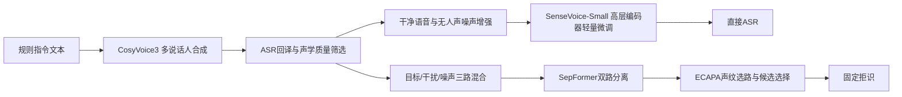

# CosyVoice3 SyntheticAug SenseVoice

作者：苗桐郡

本项目复现“规则文本生成 + CosyVoice3 多说话人语音合成 + 噪声课程增强 + SenseVoice-Small 轻量微调”，并扩展了 SepFormer 双路分离、ECAPA 声纹选路、候选选择和固定拒识评测。

## 结论

- 合成增强 checkpoint 在独立测试的直接 ASR 上有小幅改善。
- datasetA test 的直接识别 CER 从 30.12% 降至 29.38%，降低 0.74 个百分点。
- V3 -20 dB 的直接识别 CER 从 71.74% 降至 70.81%，降低 0.93 个百分点。
- 分离选择器与固定拒识组成的完整新链路没有超过已有 BalancedReject，因此没有替换已有提交结果。

项目如实保留正结果和负结果。当前有效贡献是合成增强对直接 ASR 的小幅泛化收益；当前主要短板是极难重叠语音中的目标声道选择和拒识规则跨数据集泛化。

## 方法与效果总览

图中上半部分说明合成增强checkpoint在datasetA和V3两个独立测试集均小幅降低直接ASR的CER；下半部分说明新完整链路的CER、RR和误拒率均未超过旧BalancedReject，因此当前只保留合成增强成果，不替换旧提交版。详细解读见`方法效果可视化.md`。

## 算法流程

## 目录

- `programs/`：数据准备、TTS、混音、训练、分离、选路和评测程序。
- `configs/`：去除本机绝对路径后的复现实验配置。
- `examples/`：不含真实数据的manifest字段示例。
- `results/`：独立评测指标和消融结果，不包含测试标签或逐条预测。
- `visuals/`：指标对比图。
- `samples/`：使用 HI-MIA-CW 公开说话人参考生成的少量合成试听样例。
- `方法效果可视化.md`：方法流程、核心效果和采用决策的一页式说明。

## 复现顺序

1. 使用 `prepare_tts_texts.py` 生成规则文本和固定切分。
2. 使用 `run_local_tts.py` 调用 CosyVoice3 合成语音。
3. 使用 `validate_tts_corpus.py` 和 SenseVoice 回译结果筛选样本。
4. 使用 `build_tts_mixtures.py` 生成训练增强和 TSE 四元组。
5. 使用 `train_stage5a_sensevoice.py` 完成高层编码器轻量微调。
6. 使用 SepFormer、ECAPA 和选择器程序进行重叠语音候选实验。
7. 锁定模型和阈值后运行 Stage 6 独立评测程序。

详细命令和环境划分见 `复现指南.md`。模型权重和完整数据集不包含在仓库中。请从官方来源下载 `iic/SenseVoiceSmall`、`FunAudioLLM/Fun-CosyVoice3-0.5B-2512`、`speechbrain/sepformer-whamr16k` 和 `speechbrain/spkrec-ecapa-voxceleb`。

## 数据边界

datasetA 和 V3 只用于独立测试，不参与训练、模型选择或阈值调整。训练来源是本人允许使用的清晰录音、规则生成文本、公开 HI-MIA-CW 参考音频和无人声噪声。仓库不包含个人原始录音、个人声纹克隆样例、竞赛测试音频、测试标签、完整合成语料或模型权重。
