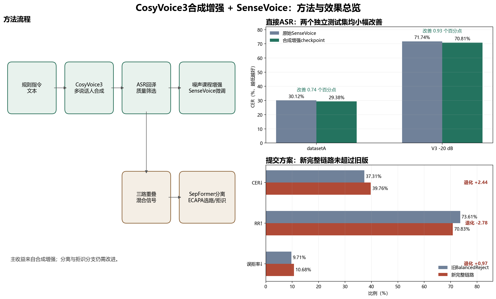

# 方法效果可视化

## 图中结论

1. **合成增强有效，但提升幅度较小。** CosyVoice3生成多说话人指令，经质量筛选和噪声课程增强后用于SenseVoice轻量微调。datasetA直接ASR的CER从30.12%降至29.38%，V3 `-20 dB`从71.74%降至70.81%。两个独立测试集都改善，说明收益不是只出现在单一数据集。
2. **完整分离链路没有达到替换条件。** 新checkpoint接入固定拒识后，datasetA的CER为39.76%、RR为70.83%、误拒率为10.68%；相比旧BalancedReject的37.31%、73.61%、9.71%，三项指标都略差。
3. **最终决策是保留有效模块，不替换旧提交。** 合成增强checkpoint可作为后续ASR改进基础；SepFormer分离、ECAPA选路和固定拒识组合仍需提高跨数据集泛化能力。

## 如何理解

- CER越低越好，表示正样本转写错误更少。
- RR越高越好，表示负样本拒识更准确。
- 误拒率越低越好，表示有效指令被错误丢弃得更少。
- 本方法目前证明了“合成数据能小幅改善直接ASR”，但尚未证明“完整分离与拒识链路优于旧提交版”。
