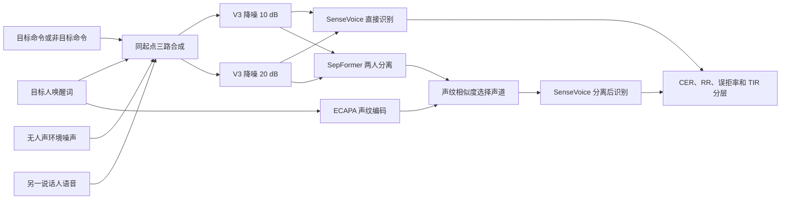

# 苗桐郡：SameStartV3、TIR 分层与 SenseVoice 识别

## 任务说明

本项目复现三路语音合成和识别流程：将目标说话人、重叠干扰说话人和无人声环境噪声合成为短音频，使用干净唤醒词提供目标说话人参考，再比较直接 ASR 与目标说话人分离后 ASR 的效果。

datasetA 只用于独立评测，不用于训练、参数拟合或重新合成。

## 算法流程



## 复原的合成条件

- 16 kHz、单声道、PCM16 WAV。
- 两个人声都从 0 秒开始，实际重叠率 100%。
- 每条音频包含两路人声和一路无人声噪声。
- 命令段 TIR 为 `-10～10 dB`。
- 唤醒段 80% 使用 `-10～10 dB`，20% 使用 `-20～-10 dB`。
- 两个版本的有效 SNR 分别为 `5～15 dB` 和 `15～25 dB`。
- 混合后使用 `-1 dBFS` 峰值上限。

## 推荐 ASR 设置

```yaml
model: iic/SenseVoiceSmall
language: zh
use_itn: false
vad: false
```

在 datasetA 和两个 V3 全量版本上，关闭 ITN 和关闭 VAD 的 CER 均低于对应对照。

## 复现命令

环境检查：

```powershell
python -m unittest discover -s tests -p "test_stage*.py" -v
```

SenseVoice 推理：

```powershell
python programs/run_infer.py `
  --manifest <infer_manifest.jsonl> `
  --model iic/SenseVoiceSmall `
  --out <pred.jsonl> `
  --device cuda:0 `
  --language zh `
  --no-vad `
  --disable-update
```

指标计算：

```powershell
python programs/evaluate_datasetA.py `
  --manifest <infer_manifest.jsonl> `
  --pred <pred.jsonl> `
  --out <metrics.json>
```

目标说话人候选链路：

```powershell
python programs/run_tse_speechbrain.py `
  --manifest <infer_manifest.jsonl> `
  --out-manifest <tse_manifest.jsonl> `
  --out-audio-dir <tse_audio> `
  --meta <tse_meta.json> `
  --config configs/tse_speechbrain.yaml `
  --fallback fail
```

## 主要结论

- datasetA 当前可提交均衡版本为 CER 37.31%、RR 73.61%、正样本误拒率 9.71%。
- V3 两个版本的直接识别 CER 分别为 70.92% 和 71.74%，RR 均为 0%。
- 单纯再降低 10 dB 无人声噪声没有稳定改善，主要错误来自重叠说话人比目标人更强。
- 通用 SepFormer 在短中文强重叠语音上产生明显失真，未作为优化方案采用。
- 下一步应使用由唤醒词声纹直接控制的条件式目标说话人提取模型，而不是继续调普通降噪。

完整数字见 `检测结果摘要.md` 和 `results/metrics_summary.json`。
